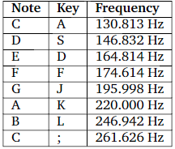

# FPGA Synthesizer

This program was wiritten to work with the DE1-SoC Development Kit.
The project is a mix of C and ARM-v7 assembly language and interacts with the I/O devices of the FPGA. A PS/2 keyboard is required to interact with the program.
The keys are mapped to play a sound of a certain frequency.

    

The board can be pluged into a display with a VGA port to display the shape of the sound waves.

## Controls
The up and down arrow keys are used to tune the volume.

The right and left keys are used to change octaves.

## Logic
A control loop continuously reads the keyboard inputs an proceses it whenerver it is valid. Flags and data structures keeping track of which keys are pressed is updated. Concurently, a timer is set up to triger an interrupt service routine every 20 microseconds to match the sampling rate of the FPGA (48 000 samples/second) to update a flag that indicate the timeouot. Once the control loops sees the flag, the amplitude of the sound needed to be written to the audio port is calculated depending on which keys are pressed at the current time. The same output is drawn onto the screen which can be seen by the user.
